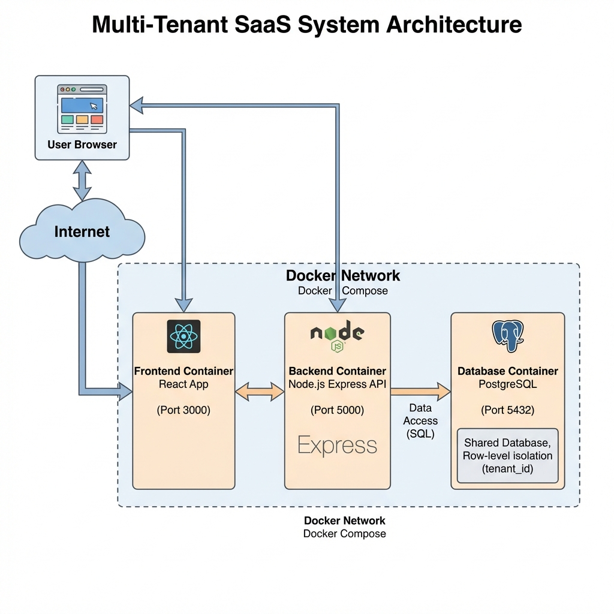
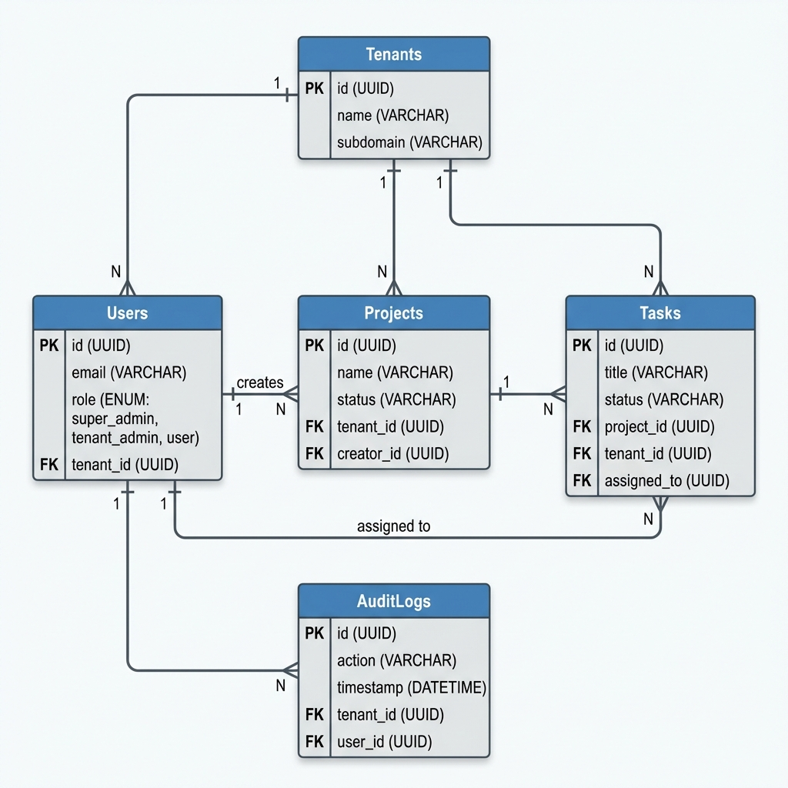

System Architecture
1. High-Level Architecture Overview

The application follows a client-server architecture consisting of a frontend,
backend API, and a database. The frontend is built using React and communicates
with the backend through RESTful APIs. The backend is developed using Node.js
with Express and handles business logic, authentication, authorization, and
tenant isolation. PostgreSQL is used as the primary database, storing all
tenant-specific and system data.

Docker is used to containerize the application components, ensuring consistency
across development and deployment environments.

2. Component Diagram Description

The system consists of the following main components:

Frontend (React): Handles user interactions and displays tenant-specific
data.

Backend API (Node.js + Express): Processes requests, enforces security,
and manages business logic.

Authentication Module: Validates JWT tokens and extracts user and
tenant information.

Database (PostgreSQL): Stores tenant, user, project, task, and audit log
data.

Docker Services: Manage and orchestrate application components.

Each component communicates through well-defined interfaces, ensuring modular
and maintainable system design.

3. Authentication & Authorization Flow

Users authenticate by providing valid credentials to the backend API. Upon
successful authentication, a JWT token is generated and returned to the
client. This token includes the user_id, role, and tenant_id.

For every subsequent request, the client includes the JWT token in the
Authorization header. Middleware in the backend validates the token and enforces
role-based access control. Unauthorized or invalid requests are rejected before
reaching the business logic layer.

4. Multi-Tenancy Data Flow

Multi-tenancy is implemented using a shared database and shared schema approach.
Each tenant-specific table includes a tenant_id column.

When a request is received, the backend extracts the tenant_id from the JWT
token and applies it as a mandatory filter to all database queries. This ensures
that users can only access data belonging to their own tenant, maintaining data
isolation across tenants.

5. Error Handling Strategy

The backend implements centralized error handling middleware to capture and
process errors consistently. Validation errors, authentication failures, and
authorization issues are handled gracefully with appropriate HTTP status codes
and error messages.

Unexpected system errors are logged and return a generic error response to the
client to prevent information leakage.

6. Logging & Monitoring

The system includes logging mechanisms to track application events, errors, and
user actions. Audit logs record critical operations such as login attempts,
data creation, updates, and deletions.

Logs include metadata such as user_id, tenant_id, timestamp, and action
performed. These logs support debugging, security monitoring, and compliance
requirements.